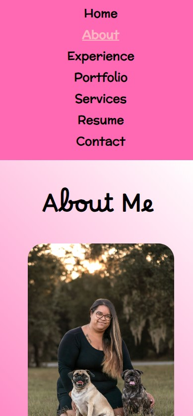

# Caitlin Ramsey React Portfolio

[](https://opensource.org/licenses/MIT)

## Description
This responsive portfolio was built with [React](https://react.dev/) and deployed to [Netlify](https://www.netlify.com/?attr=homepage-modal). Learn about me, my experience, some of my previous projects, what services I offer, view and download my resume, and contact me from this website.

## Table of Contents
- [Installation](#installation)
- [Usage](#usage)
- [Mockup](#mockup)
- [Contributing](#contributing)
- [GitHub](#github)
- [Email](#email)
- [Deployed Application](#deployed-application)

## Installation
The user can navigate [here](https://doubledowncreations.netlify.app) to view my porfolio.

## Usage
### User Story

```md
AS AN employer looking for candidates with experience building single-page applications
I WANT to view a potential employee's deployed React portfolio of work samples
SO THAT I can assess whether they're a good candidate for an open position
```

### Acceptance Criteria 

```md
GIVEN a single-page application portfolio for a web developer
WHEN I load the portfolio
THEN I am presented with a page containing a header, a section for content, and a footer
WHEN I view the header
THEN I am presented with the developer's name and navigation with titles corresponding to different sections of the portfolio
WHEN I view the navigation titles
THEN I am presented with the titles About Me, Portfolio, Contact, and Resume, and the title corresponding to the current section is highlighted
WHEN I click on a navigation title
THEN I am presented with the corresponding section below the navigation without the page reloading and that title is highlighted
WHEN I load the portfolio the first time
THEN the About Me title and section are selected by default
WHEN I am presented with the About Me section
THEN I see a recent photo or avatar of the developer and a short bio about them
WHEN I am presented with the Portfolio section
THEN I see titled images of six of the developer’s applications with links to both the deployed applications and the corresponding GitHub repository
WHEN I am presented with the Contact section
THEN I see a contact form with fields for a name, an email address, and a message
WHEN I move my cursor out of one of the form fields without entering text
THEN I receive a notification that this field is required
WHEN I enter text into the email address field
THEN I receive a notification if I have entered an invalid email address
WHEN I am presented with the Resume section
THEN I see a link to a downloadable resume and a list of the developer’s proficiencies
WHEN I view the footer
THEN I am presented with text or icon links to the developer’s GitHub and LinkedIn profiles, and their profile on a third platform (Stack Overflow, Twitter) 
```

## Mockup
This is what it looks like on a larger screen:


<br />
This is what it looks like on a mobile device:
<br />
<br />


## Contributing
Please email me to discuss contributing.

## GitHub
GitHub: https://github.com/caitlinramsey/react-portfolio

## Email
Email: caitlinramsey@outlook.com

## Deployed Application
The deployed application can viewed [here](https://doubledowncreations.netlify.app).
